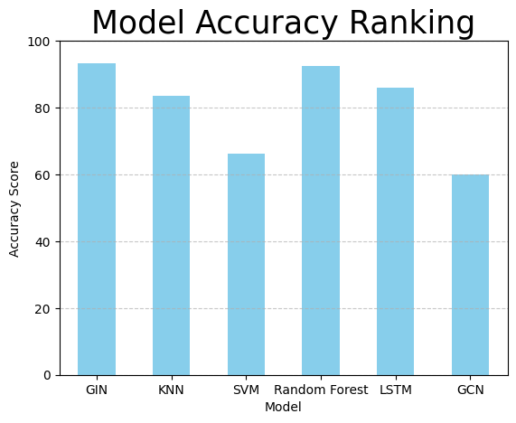
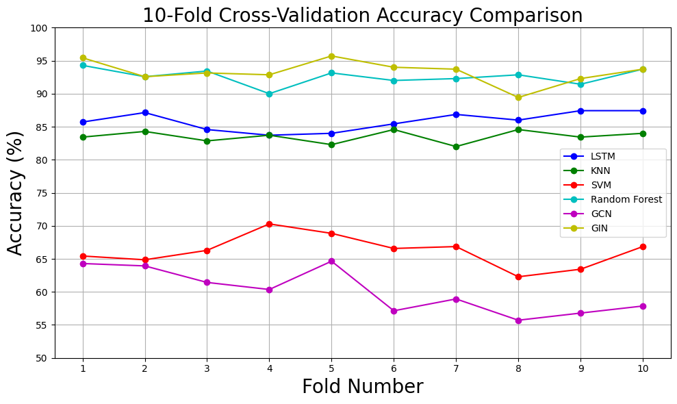

# EEG Data Classification Using GNNs and Traditional Classifiers  

This project explores the classification of EEG data into six different categories using both graph-based and traditional machine learning models. The implementation leverages **Graph Neural Networks (GNNs)** alongside traditional models to compare their performance across metrics like accuracy, precision, recall, and F1-score.  

## **Models and Metrics**  

The performance of six classifiers was compared, highlighting the superiority of the **GIN (Graph Isomorphism Network)** model for EEG data classification. Below are the mean metrics achieved by each model using **10-fold Cross-Validation (10CV):**  

| **Model**         | **Accuracy** | **Precision** | **Recall** | **F1-Score** |
|--------------------|--------------|---------------|------------|--------------|
| **GIN**           | 93.29        | 93.42         | 93.29      | 93.21        |
| **KNN**           | 83.51        | 83.58         | 83.51      | 82.68        |
| **SVM**           | 66.17        | 67.12         | 66.17      | 65.67        |
| **Random Forest** | 92.57        | 92.66         | 92.57      | 92.50        |
| **LSTM**          | 85.83        | 85.84         | 85.83      | 85.51        |
| **GCN**           | 60.11        | 61.19         | 60.11      | 58.86        |  

### **Key Observations**  

- **GIN** achieved the highest overall metrics, outperforming all other models in accuracy, precision, recall, and F1-score.  
- **Random Forest** followed closely behind, indicating strong performance among traditional classifiers.  
- **KNN and LSTM** demonstrated moderate performance, while **SVM** and **GCN** had lower classification results for this dataset.  
- **10CV** ensured robust evaluation by splitting the dataset into 10 equal parts, using nine for training and one for validation in each iteration.  

## **Graph-Based Data Structure**  

The EEG dataset was structured as graphs to enable GNN-based analysis. Each graph includes:  

- **Nodes**: Represent EEG channels (19 nodes for 19 channels).  
- **Edges**: Capture inter-channel relationships using coherence values (171 edges per graph).  
- **Node Features**: Specific frequency band data for each EEG channel, resulting in a feature shape of `[19, 6]`.  

### **Feature Structure**  

Each graph consists of:  

- **Node Features**: Six features per node, corresponding to frequency bands (e.g., delta, theta, alpha, beta, gamma, and a specific band).  
- **Edge Attributes**: Six coherence values per edge for inter-channel relationships.  
- **Graph Label**: One of six possible classes (target variable).  

### **Graph Summary**  

- **Number of Nodes**: 19  
- **Number of Edges**: 171  
- **Node Feature Shape**: `[19, 6]`  
- **Edge Attribute Shape**: `[171, 6]`  
- **Graph Label**: Categorical (classes 0–5)  

## **Visualization**  

Below are visualizations highlighting the performance comparison and graph data representation:  

  
  

